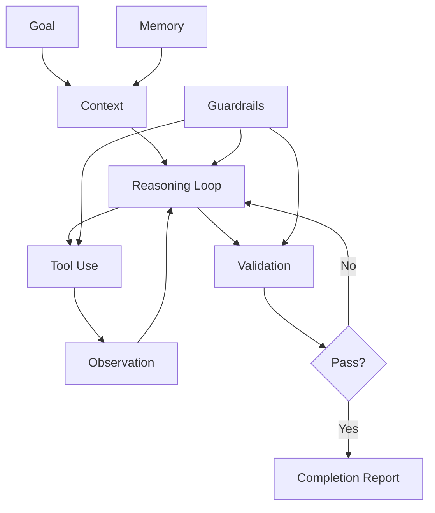

# Agent Anatomy

[← What Is AI](what-is-ai.md) | [Home](Home.md) | [Next: AI in Software Engineering](ai-in-software-engineering.md)

An AI agent is not simply a prompt and not truly autonomous in the human sense. In software engineering, an agent is better understood as a bounded execution loop that uses an AI model, context, tools, and validation to work toward a task goal.

```text
Agent = Goal + Context + Reasoning Loop + Tools + Memory + Guardrails + Validation + Reporting
```

---

## 1. Goal

The goal defines what the agent is trying to accomplish.

Examples:

- fix a bug
- add a command handler
- generate a code-map
- update documentation
- review a pull request

A vague goal produces vague behavior. A good goal has:

- task type
- scope
- expected outputs
- constraints
- done criteria

---

## 2. Context

Context is the information the agent uses to understand the task.

In AI-for-SE, useful context includes:

- user request
- micro-spec
- architecture guidance
- project configuration
- project patterns
- code-map or filtered submap
- relevant source files
- tests and errors

Context should be scoped. Do not feed the entire project if a filtered code-map can identify the relevant files.

---

## 3. Reasoning Loop

The reasoning loop is the control flow that decides what to do next.

A simple loop looks like this:

```text
observe → plan → act → validate → adjust → report
```

For software engineering:

```text
read task
  ↓
inspect context
  ↓
select skill
  ↓
identify affected files
  ↓
apply change
  ↓
run validation
  ↓
repair if needed
  ↓
produce completion report
```

The reasoning loop is where many agents become dangerous if unconstrained. The loop should have limits:

- maximum number of iterations
- allowed tools
- allowed files or folders
- stop conditions
- required validation before completion

---

## 4. Tools

Tools let the agent act outside the model.

Examples:

- read files
- search code
- run tests
- generate code-map
- filter code-map
- create or edit files
- open pull requests

Tools should be explicit and permissioned. An agent should not have unrestricted power by default.

---

## 5. Memory

Memory is information persisted across tasks.

For AI-for-SE, prefer explicit memory stored in repository files:

- `.ai/architecture.md`
- `.ai/app.config.json`
- `.ai/project-patterns.md`
- `.ai/skills/*.md`
- `.ai/code-map.full.json`
- `specs/*.md`

Avoid relying on hidden conversational memory as the source of truth. Repository memory is reviewable, versioned, and shared by the team.

---

## 6. Guardrails

Guardrails define what the agent may and may not do.

Examples:

- do not put business logic in controllers
- do not bypass repositories
- do not invent a new folder structure
- do not change public contracts unless required
- do not refactor unrelated files
- always inspect source files before editing existing code

Guardrails can come from:

- architecture guidance
- project patterns
- selected skill
- validation scripts
- permissions
- human review

---

## 7. Validation

Validation is how the agent proves the work is acceptable.

Examples:

- build succeeds
- tests pass
- lint passes
- task context exists
- code-map regenerated if needed
- forbidden dependency rules are not violated

Validation should be automated where possible.

```text
AI proposes or edits.
Scripts verify.
Human reviews final judgment.
```

---

## 8. Reporting

The agent should finish with a completion report.

A useful report includes:

- task summary
- files changed
- decisions made
- assumptions
- tests run
- validation results
- follow-up risks

Without reporting, agent behavior becomes hard to audit.

---

## Minimal Agent Pseudocode

```ts
type AgentInput = {
  goal: string;
  microSpec?: string;
  contextFiles: string[];
  allowedTools: string[];
};

async function runAgent(input: AgentInput) {
  const context = await loadContext(input.contextFiles);
  const plan = await model.plan(input.goal, context);

  for (const step of plan.steps) {
    if (!isToolAllowed(step.tool, input.allowedTools)) {
      throw new Error(`Tool not allowed: ${step.tool}`);
    }

    const result = await runTool(step.tool, step.args);
    await recordObservation(result);

    if (result.failed) {
      const repairPlan = await model.repair(input.goal, context, result);
      await applyRepairPlan(repairPlan);
    }
  }

  const validation = await runValidation();
  return createCompletionReport(plan, validation);
}
```

---

## Agent Anatomy Diagram



---

## In AI-for-SE Terms

An engineering agent should not be treated as an independent developer. It should be treated as a bounded executor operating inside an explicit engineering system.

```text
Agent = bounded executor
Skill = task procedure
Micro-spec = task contract
Code-map = navigation aid
Architecture = guardrails
Validation = proof of acceptability
```

---

## Navigation

[← What Is AI](what-is-ai.md) | [Home](Home.md) | [Next: AI in Software Engineering](ai-in-software-engineering.md)
