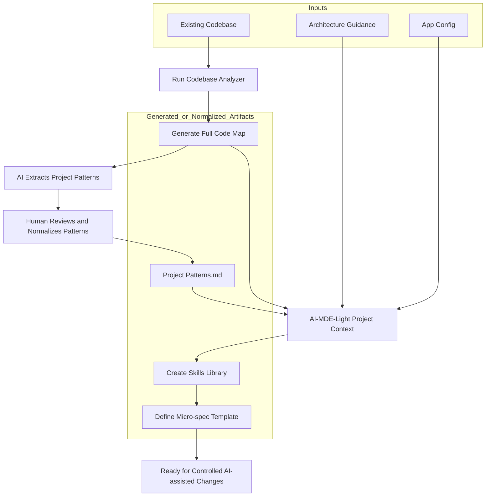
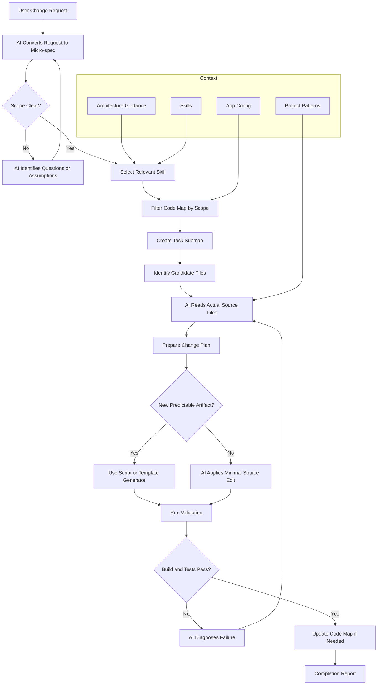

# AI-MDE-Light Diagrams

[← Home](Home.md) | [← Use Cases](use-cases.md) | [Next: Architecture Guidance](../.ai/architecture.md)

This page captures the main operating flows for AI-MDE-Light.

> GitHub renders Mermaid diagrams directly. The diagrams below are active/editable Markdown diagrams. The link sections under each diagram make the nodes navigable.

---

## 1. Project AI Initiation for an Existing Codebase

This flow is used when AI-MDE-Light is introduced into an existing software project.



### Node Links

| Diagram Node | Repository Link |
|---|---|
| Run Codebase Analyzer | [`tools/analyze-codebase.ts`](../tools/analyze-codebase.ts) |
| Generate Full Code Map | [Code Map section](ai-mde-light.md#6-code-map) |
| AI Extracts Project Patterns | [Extract Project Patterns Skill](../.ai/skills/extract-project-patterns.md) |
| Project Patterns.md | [`.ai/project-patterns.md`](../.ai/project-patterns.md) |
| Architecture Guidance | [`.ai/architecture.md`](../.ai/architecture.md) |
| App Config | [`.ai/app.config.json`](../.ai/app.config.json) |
| Create Skills Library | [Skills section](Home.md#skills) |
| Define Micro-spec Template | [`specs/micro-spec.template.md`](../specs/micro-spec.template.md) |
| Controlled AI-assisted Changes | [Change Request Flow](#2-change-request-flow) |

### Purpose

The goal is to convert an existing codebase from implicit knowledge into explicit AI-usable context.

### Output

After initiation, the project should have:

- `.ai/architecture.md`
- `.ai/app.config.json`
- `.ai/project-patterns.md`
- `.ai/skills/*.md`
- `.ai/code-map.full.json`
- `specs/micro-spec.template.md`

---

## 2. Change Request Flow

This flow is used when a user asks for a new feature, fix, enhancement, or integration.



### Node Links

| Diagram Node | Repository Link |
|---|---|
| User Change Request | [Use Cases](use-cases.md) |
| Micro-spec | [`specs/micro-spec.template.md`](../specs/micro-spec.template.md) |
| Select Relevant Skill | [Skills section](Home.md#skills) |
| Filter Code Map by Scope | [`tools/filter-code-map.ts`](../tools/filter-code-map.ts) |
| Create Task Submap | [Code Map section](ai-mde-light.md#6-code-map) |
| AI Reads Actual Source Files | [Existing Code Integration Use Case](use-cases.md#uc-04-integrate-a-feature-into-existing-code) |
| Use Script or Template Generator | [`tools/`](../tools) |
| AI Applies Minimal Source Edit | [Fix Bug Skill](../.ai/skills/fix-bug.md) |
| Run Validation | [`tools/validate-task.ts`](../tools/validate-task.ts) |
| Update Code Map | [`tools/analyze-codebase.ts`](../tools/analyze-codebase.ts) |
| Completion Report | [Use Cases](use-cases.md) |
| Architecture Guidance | [`.ai/architecture.md`](../.ai/architecture.md) |
| App Config | [`.ai/app.config.json`](../.ai/app.config.json) |
| Project Patterns | [`.ai/project-patterns.md`](../.ai/project-patterns.md) |
| Skills | [Skills section](Home.md#skills) |

### Purpose

The goal is not to let AI freely edit the repo. The goal is to constrain the AI through:

- micro-spec scope
- selected skill
- filtered code-map
- actual source inspection
- validation scripts
- completion report

### Key Principle

```text
Code-map = navigation and impact analysis
Source code = implementation detail
Skills = procedure
Micro-spec = task contract
Scripts = validation and deterministic generation
```

---

## Navigation

[← Home](Home.md) | [← Use Cases](use-cases.md) | [Next: Architecture Guidance](../.ai/architecture.md)
