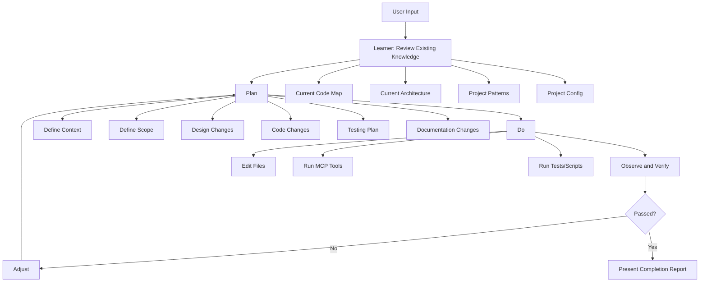

# MDE Supervisor Workflow

[← Agent Anatomy](agent-anatomy.md) | [Home](Home.md)

This page defines the practical execution loop for the MDE agent when operating inside an AI client such as Claude Code.

The MDE agent is not a standalone executable. It is project-specific supervisory behavior inside the AI client. It uses repository knowledge, MCP tools, scripts, and validation to handle software engineering requests in a controlled way.

---

## Workflow Summary

```text
1. Take request from user input
2. Learn / review current knowledge
3. Plan
4. Do
5. Observe and verify
6. Adjust
7. Present
```

---

## 1. Take Request from User Input

The user provides a natural-language engineering request.

Examples:

```text
The login screen is broken after the last refactor. Can you take a look?
```

```text
Add approval to leave requests.
```

```text
Prepare this repo for AI-assisted development.
```

The AI client should treat software engineering requests in this repository as candidates for the MDE workflow.

---

## 2. Learner: Review Existing Knowledge

Before planning, the agent reviews current project knowledge.

Relevant knowledge includes:

- current code-map
- current architecture guidance
- project patterns
- project configuration
- relevant micro-specs
- existing documentation
- prior completion reports, if available

The purpose of this step is to avoid starting from zero on every request.

---

## 3. Plan

The agent defines the work before editing.

Planning includes:

- define the context
- define scope of work
- outline design changes
- outline code changes
- outline testing plan
- outline documentation changes

The plan should identify:

- likely command or workflow
- relevant skill(s)
- relevant files or modules
- required MCP tools or scripts
- validation gates
- assumptions or open questions

---

## 4. Do

The agent performs the work using controlled actions.

Typical actions:

- edit files
- call MCP tools
- run scripts
- run tests
- update docs
- update code-map or context files when needed

This is where the agent moves from reasoning to action.

---

## 5. Observe and Verify

The agent inspects the results of the action.

Observation includes:

- errors
- test output
- build output
- diffs
- generated files
- validation results

Verification asks:

- did the change build?
- did tests pass?
- did the scope stay controlled?
- did the change follow architecture and patterns?
- are docs or code-map updates required?

---

## 6. Adjust

If verification fails, the agent repairs or narrows the work.

Adjustment may include:

- fixing compile errors
- updating tests
- revising the implementation
- reducing scope
- asking one focused question
- documenting an assumption

The agent should not loop forever. The workflow should have explicit stop limits.

---

## 7. Present

The agent finishes with a completion report.

The report should include:

- request summary
- selected command/workflow
- scope of work
- files changed
- design changes
- code changes
- tests run
- documentation changes
- validation result
- assumptions
- follow-up items

---

## Diagram



---

## MCP Relationship

MCP tools are used primarily in the **Do** and **Observe/Verify** stages.

Examples:

```text
mde_generate_code_map
mde_filter_code_map
mde_fix_bug
mde_integrate_feature
mde_validate_task
```

The MDE agent does not replace MCP. It uses MCP.

```text
Natural-language request → MDE workflow → MCP command/tool → feedback → report
```

---

## Claude Code Usage

A user may type:

```text
The login screen is broken after the last refactor. Can you take a look?
```

Claude Code should interpret this as:

```text
Use the MDE supervisor workflow.
Likely command: fix-bug.
Review current knowledge.
Plan scope.
Use MCP/tools as needed.
Verify.
Report.
```

---

## Navigation

[← Agent Anatomy](agent-anatomy.md) | [Home](Home.md)
