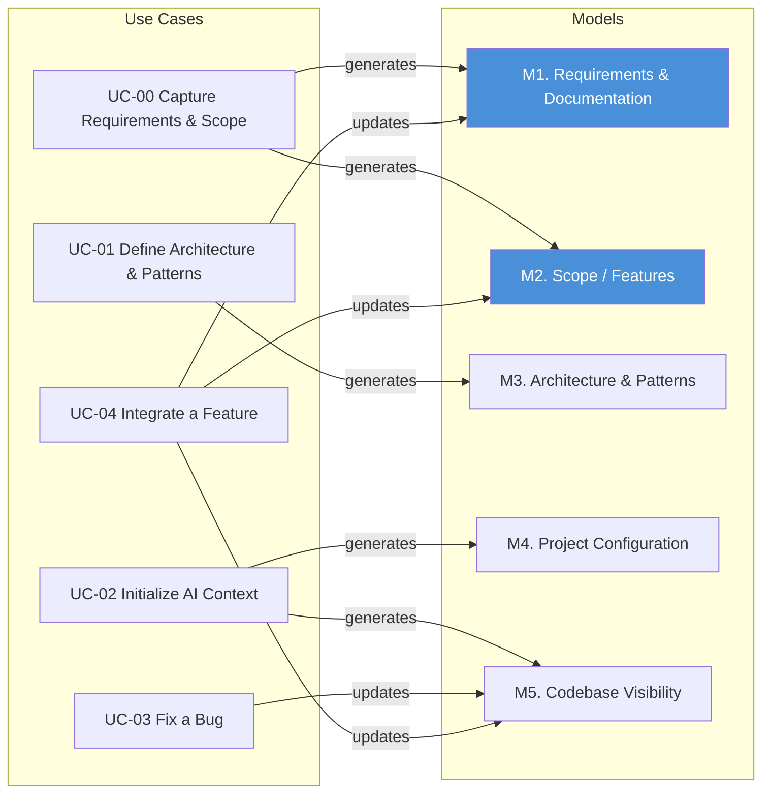

# Required Components (Models)

[← Required Capabilities](required-capabilities.md) | [Next: Use Cases](use-cases.md)

Based on the [required capabilities](required-capabilities.md), these are the knowledge structures a structured approach needs. This is not a solution or framework ��� it is a decomposition of what must exist, regardless of implementation.

Models are the meta-level knowledge structures that give AI and tooling a shared understanding of the system. They persist across tasks and interactions. [Use cases](use-cases.md) describe the activities that consume them.

---

## M1. Requirements and Documentation (Intent)

Capture what the system must do, why, and the supporting documentation that gives it context.

- Functional requirements and acceptance criteria
- Business rules and constraints
- Stakeholder goals and priorities
- Supporting documentation (design decisions, domain glossaries, onboarding guides, API contracts)
- Traceability from requirement to implementation

This is the upstream input that everything else serves. Without explicit requirements, AI infers intent from code — which is guessing backwards from the answer. Without documentation, AI cannot distinguish a deliberate decision from an accident.

In practice, most projects have some draft of requirements and scattered documentation — incomplete, spread across documents, tickets, wikis, and conversations. This model is not a one-time deliverable. It is a living structure that gets verified and refined continuously as the team builds, discovers edge cases, and receives feedback. AI can help surface gaps ("this requirement has no acceptance criteria"), detect drift ("the code does X but the requirement says Y"), and keep documentation aligned with the current state of the system.

## M2. Project Scope and Product Features

Define the boundaries and feature inventory of the product.

- Product feature list and feature status (planned, in progress, delivered)
- Module/domain boundaries
- What is in scope vs. out of scope
- Release or milestone grouping

Like requirements, scope and feature definitions are rarely complete upfront. They typically start as a rough outline and evolve through delivery. AI can help maintain them — extracting feature boundaries from code, flagging scope creep, and keeping the feature inventory aligned with what's actually built.

When this model exists, it helps AI understand where a change fits in the larger picture. When it doesn't, AI treats every change as isolated.

## M3. Architecture and Patterns

Define the rules of the system and how they are applied in practice.

**Guardrails** — what is allowed and what is not:

- Layering rules (e.g., controller -> service -> domain -> repository)
- Allowed dependencies
- Cross-cutting concerns (logging, security, transactions)

**Patterns** — how common problems are solved in this project:

- CRUD patterns
- Command/query handling
- Validation approach
- Error handling

Guardrails set the constraints. Patterns show how to work within them.

## M4. Project Configuration

Define how the application is structured and organized.

- Folder structure and naming conventions
- Technology stack choices
- Environment setup

## M5. Codebase Visibility

Provide a structural understanding of the existing codebase.

- File structure and relationships between components
- Key entry points
- Impact analysis for proposed changes

---

## How Use Cases Generate and Consume Models



**Key observations:**
- UC-00 generates M1 (Requirements & Documentation) and M2 (Scope / Features) — and refreshes them as the system evolves.
- UC-01 generates M3 (Architecture & Patterns) — both guidelines and extracted patterns.
- UC-02 generates M4 (Project Configuration) and M5 (Codebase Visibility).
- UC-03 and UC-04 update M5 as the codebase changes. UC-04 also refines M1 and M2 as building reveals missing requirements and scope changes.

---

## Summary

```text
These models give AI the context it lacks by default.
Without them, every interaction starts from zero
and every answer is an inference.
```

---

## Navigation

[← Required Capabilities](required-capabilities.md) | [Next: Use Cases](use-cases.md)
