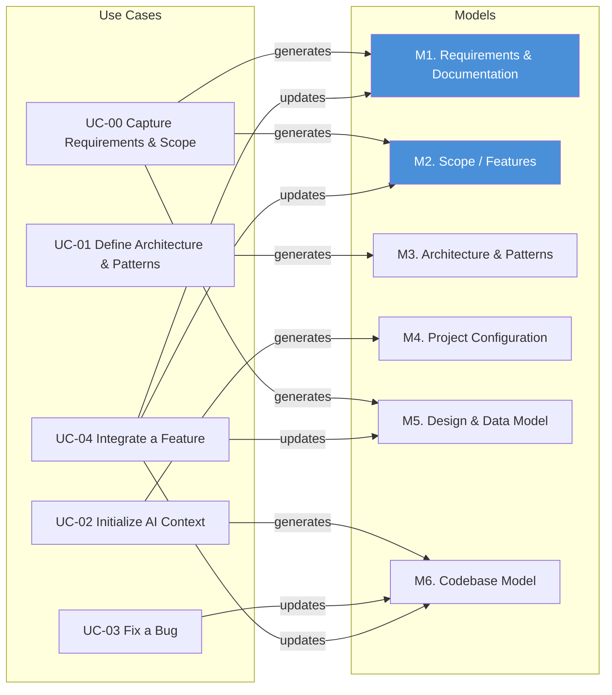

# Required Components (Models)

[← Required Capabilities](required-capabilities.md) | [Next: Use Cases](use-cases.md)

Based on the [required capabilities](required-capabilities.md), these are the knowledge structures a structured approach needs. This is not a solution or framework; it is a decomposition of what must exist, regardless of implementation.

Models are the meta-level knowledge structures that give AI and tooling a shared understanding of the system. They persist across tasks and interactions. [Use cases](use-cases.md) describe the activities that consume them.

---

## M1. Requirements and Documentation (Intent) — [sample](../samples/m1-requirements-and-documentation.md)

Capture what the system must do, why, and the supporting documentation that gives it context.

- Functional requirements and acceptance criteria
- Business rules and constraints
- Stakeholder goals and priorities
- Supporting documentation (design decisions, domain glossaries, onboarding guides, API contracts)
- Traceability from requirement to implementation

This is the upstream input that everything else serves. Without explicit requirements, AI infers intent from code — which is guessing backwards from the answer. Without documentation, AI cannot distinguish a deliberate decision from an accident.

In practice, most projects have some draft of requirements and scattered documentation — incomplete, spread across documents, tickets, wikis, and conversations. This model is not a one-time deliverable. It is a living structure that gets verified and refined continuously as the team builds, discovers edge cases, and receives feedback. AI can help surface gaps ("this requirement has no acceptance criteria"), detect drift ("the code does X but the requirement says Y"), and keep documentation aligned with the current state of the system.

## M2. Project Scope and Product Features — [sample](../samples/m2-scope-and-features.md)

Define the boundaries and feature inventory of the product.

- Product feature list and feature status (planned, in progress, delivered)
- Module/domain boundaries
- What is in scope vs. out of scope
- Release or milestone grouping

Like requirements, scope and feature definitions are rarely complete upfront. They typically start as a rough outline and evolve through delivery. AI can help maintain them — extracting feature boundaries from code, flagging scope creep, and keeping the feature inventory aligned with what's actually built.

When this model exists, it helps AI understand where a change fits in the larger picture. When it doesn't, AI treats every change as isolated.

## M3. Architecture and Patterns — [sample](../samples/m3-architecture-and-patterns.md)

Define the rules of the system and how they are applied in practice.

**Guardrails** — what is allowed and what is not:

- Layering rules (e.g., controller -> service -> domain -> repository)
- Allowed dependencies
- Cross-cutting concerns (logging, security, transactions)

**Patterns** — how common problems are solved in this project:

- CRUD patterns
- Command/query handling
- Validation approach
- Error handling

Guardrails set the constraints. Patterns show how to work within them.

## M4. Project Configuration — [sample](../samples/m4-project-configuration.md)

Define how the application is structured and organized.

- Folder structure and naming conventions
- Technology stack choices
- Environment setup

## M5. Design and Data Model — [sample](../samples/m5-design-and-data-model.md)

Define what the system should be — its domain structure, data model, and specifications.

- Entity specifications (attributes, types, constraints, relationships, rules, lifecycle)
- Subject specifications (operations, I/O signatures, composed views)
- UI specifications (pages, fields, actions, navigation)
- Data model (ER diagram, persistence structure)

Design is the intent. Code is the implementation. They should stay aligned but are separate models.

## M6. Codebase Model — [sample](../samples/m6-codebase-model.md)

Provide a structural understanding of the existing code.

- File structure and relationships between components
- Key entry points
- Impact analysis for proposed changes
- Filtered submaps for task-scoped AI context

---

## Adoption Staging

Not all models are needed from day one. The table below shows when each model enters the picture and how much effort it takes.

| Model | When | Effort | Notes |
|---|---|---|---|
| M6. Codebase Model | At start | Automated | Run static analysis. No human effort. |
| M3. Architecture & Patterns | At start | Minimal - AI assisted | Even a half-page of layering rules and naming conventions is enough to begin. Refine over time. |
| M4. Project Configuration | At start | Minimal - AI assisted | Folder structure, stack, commands. Usually already known. |
| M5. Design & Data Model | Incremental | Per change - AI assisted | Grows with the system. Each new feature or entity adds to it. Does not need to be complete upfront. |
| M1. Requirements & Docs | When desired | Optional - AI assisted | Valuable but not a prerequisite. Many teams start without formal requirements and add them as clarity emerges. |
| M2. Scope / Features | When desired | Optional - AI assisted | Helps prevent scope creep and gives AI context, but the system works without it. |

### Practical starting point

To begin using structured AI assistance, you need three things:

1. **M6 (Codebase Model)** — run the analyzer. Done.
2. **M3 (Architecture & Patterns)** — write down the top 5 rules. Enough.
3. **M4 (Project Configuration)** — list the folder structure and stack. Usually trivial.

Everything else grows incrementally as you work. M5 (Design) builds up with each feature. M1 and M2 arrive when the team is ready for them.

---

## How Use Cases Generate and Consume Models



**Key observations:**
- UC-00 generates M1 (Requirements & Documentation), M2 (Scope / Features), and M5 (Design & Data Model) — requirements drive design.
- UC-01 generates M3 (Architecture & Patterns) — both guidelines and extracted patterns.
- UC-02 generates M4 (Project Configuration) and M6 (Codebase Model).
- UC-03 updates M6 as the codebase changes.
- UC-04 updates M1, M2, M5, and M6 — building reveals missing requirements, scope changes, design refinements, and code changes.

---

## Summary

```text
These models give AI the context it lacks by default.
Without them, every interaction starts from zero
and every answer is an inference.
```

---

## Navigation

[← Required Capabilities](required-capabilities.md) | [Next: Use Cases](use-cases.md)
