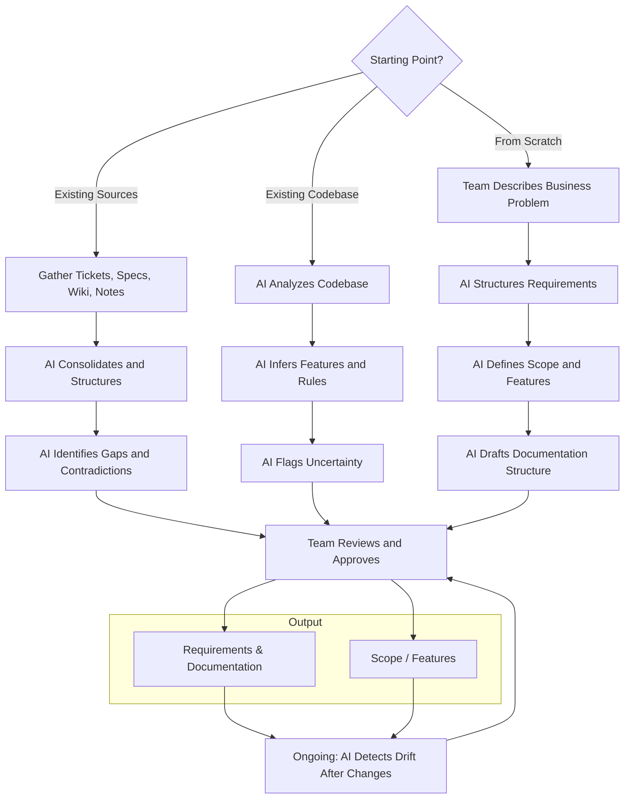

# UC-00: Capture Requirements, Documentation, and Scope

[← Use Cases](../use-cases.md)

## Goal

Establish and continuously refine the business requirements, supporting documentation, and project scope that all other use cases depend on. Without these, AI works without intent — inferring purpose from code rather than understanding it.

## Actor

Product Owner / Business Analyst / Architect / Developer

## Context

Most projects start with some combination of scattered tickets, conversations, partial specs, and tribal knowledge. This use case formalizes what exists, surfaces what's missing, and creates a living structure that evolves with the project.

## Approaches

### Option A: Extract from existing sources

Use when requirements and scope already exist in some form but are scattered or incomplete.

1. Gather existing material (tickets, specs, wiki pages, meeting notes, email threads).
2. AI organizes and consolidates into a structured format.
3. AI identifies gaps ("feature X has no acceptance criteria", "module Y has no stated purpose").
4. AI flags contradictions ("ticket says X but spec says Y").
5. Team reviews, fills gaps, resolves contradictions, and approves.

### Option B: Discover from the codebase

Use when documentation is missing but the system exists and works.

1. AI analyzes the codebase to infer features, modules, and business rules.
2. AI proposes a draft requirements document and scope/feature inventory based on what the code does.
3. AI flags areas of uncertainty ("this branch suggests a business rule but it's unclear if it's intentional").
4. Team reviews, corrects, and approves — separating deliberate decisions from accidents.

### Option C: Define from scratch

Use for new projects or major new initiatives.

1. Team describes the business problem and stakeholder goals.
2. AI helps structure requirements (functional, non-functional, acceptance criteria).
3. AI helps define scope boundaries and feature breakdown.
4. AI generates a draft documentation structure (glossary, domain model, API contracts).
5. Team reviews and approves.

## Ongoing Refresh

This is not a one-time activity. Requirements and scope evolve as the team builds.

1. After each significant change (UC-04), AI checks whether requirements and scope need updating.
2. AI surfaces drift ("the code now does X but the requirement still says Y").
3. AI proposes updates to requirements, documentation, or scope.
4. Team reviews and approves.

## Diagram

## Output

- Structured requirements with acceptance criteria
- Business rules inventory
- Supporting documentation (glossary, domain model, design decisions, API contracts)
- Project scope definition and feature inventory
- Gap and contradiction report

## Models Produced

M1 (Requirements & Documentation), M2 (Scope / Features).

---

[← Use Cases](../use-cases.md)
