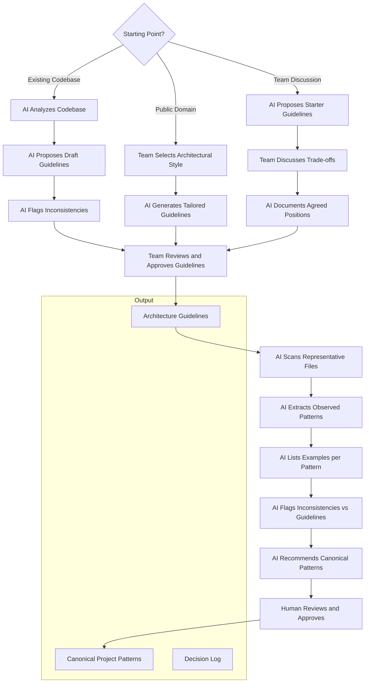

# UC-01: Define Architecture, Patterns, and Guidelines

[← Use Cases](../use-cases.md)

## Goal

Establish explicit architecture guidelines and canonical project patterns that AI and the team can reference for all future work. This is a prerequisite for every other use case — without it, AI infers structure from patterns it finds, and the team has no shared reference to validate against.

This use case covers both the initial creation and ongoing refresh of architecture and patterns.

## Actor

Architect / Tech Lead / Senior Developer

## Part 1: Establish Architecture Guidelines

There are three starting points. They are not mutually exclusive — a team may combine them.

### Option A: Extract from an existing codebase

Use when the project already exists and has established conventions, even if undocumented.

1. AI analyzes the codebase (folder structure, layering, naming, dependency direction).
2. AI proposes a draft architecture guideline based on observed patterns.
3. AI flags inconsistencies ("services call repositories directly in 4 places but go through a unit-of-work in 2").
4. Team reviews, resolves inconsistencies, and approves the guideline.

### Option B: Adopt from public domain

Use when starting a new project or when the team wants to align with an established approach.

1. Team identifies the architectural style (e.g., clean architecture, hexagonal, vertical slices, CQRS).
2. AI generates a guideline document tailored to the project's technology stack and domain.
3. Team reviews and adjusts to local constraints (team size, deployment model, compliance).

### Option C: AI-facilitated discussion

Use when the team has opinions but no written consensus.

1. AI proposes a starter guideline based on the technology stack and project type.
2. Team discusses — AI mediates by explaining trade-offs, surfacing contradictions, and documenting decisions.
3. AI produces the final guideline reflecting the team's agreed positions.

## Part 2: Extract and Refresh Project Patterns

Once guidelines exist, extract concrete patterns from the codebase that show how those guidelines are applied in practice. This step should be repeated periodically as the codebase evolves.

1. AI scans representative files across modules.
2. AI extracts observed patterns (e.g., how a command handler is structured, how validation is done).
3. AI lists concrete examples for each pattern.
4. AI flags inconsistencies between observed code and the architecture guidelines.
5. AI recommends canonical patterns.
6. Human reviews and approves.
7. Architecture and patterns are updated.

## Diagram

## Output

- Architecture guideline document covering:
  - Layering rules and allowed dependency direction
  - Naming conventions
  - Cross-cutting concerns (logging, security, transactions, error handling)
  - What belongs where (controllers, services, domain, repositories, DTOs)
  - What is explicitly not allowed
- Canonical project patterns with concrete examples from the codebase
- Decision log for contested choices (optional but recommended)

## Models Produced

M3 (Architecture and Patterns).

---

[← Use Cases](../use-cases.md)
