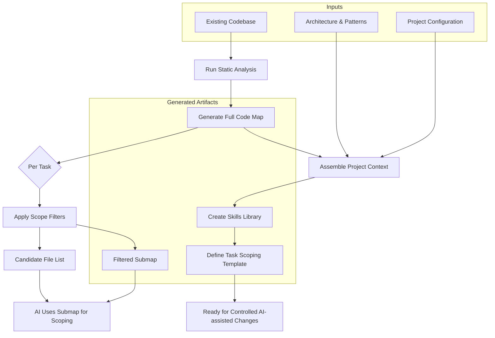

# UC-02: Initialize Structured AI Context for an Existing Codebase

[← Use Cases](../use-cases.md)

## Goal

Prepare an existing codebase so AI can work against it safely and consistently. This includes generating a structural code map and assembling all project context into an initialized state.

## Actor

Developer / Architect

## Inputs

- existing source code
- architecture and patterns (from [UC-01](uc-01-define-architecture-guidelines.md))
- application configuration
- preferred engineering conventions

## Main Flow

### Step 1: Generate Code Map

Use static analysis to build a structural understanding of the codebase.

1. Run static analysis over the source code.
2. Generate a full code map (file structure, components, relationships, entry points).
3. Verify the code map covers all modules and layers.

### Step 2: Scope Filtering (per task, ongoing)

The full code map is for tools. For each AI task, a filtered submap narrows the scope.

1. Apply task-specific filters (by module, entity, operation, route, dependency depth).
2. Generate a filtered submap and candidate file list.
3. AI uses the filtered submap to decide which source files to inspect.

### Step 3: Assemble Project Context

1. Combine code map with architecture guidelines and project configuration.
2. Confirm or create reusable skills (task playbooks).
3. Confirm the task scoping template.
4. Project is ready for controlled AI-assisted change requests.

## Diagram

## Output

- full code map
- filtered submaps (per task)
- candidate file lists (per task)
- skill library
- task scoping template
- initialized project context

## Models Produced

M4 (Project Configuration), M5 (Codebase Visibility).

---

[← Use Cases](../use-cases.md)
