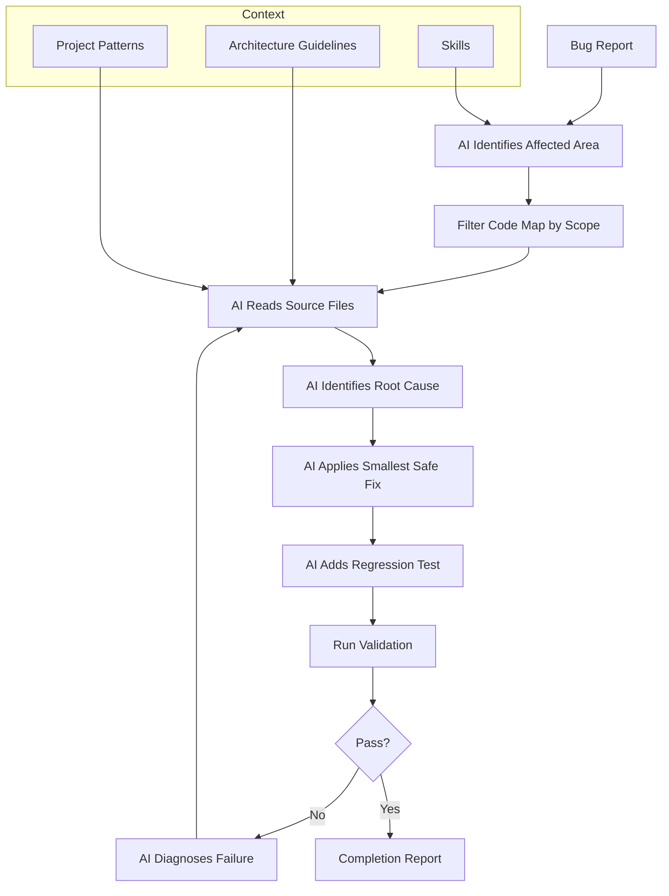

# UC-03: Fix a Bug Without Architecture Drift

[← Use Cases](../use-cases.md)

## Goal

Fix a defect with minimal change while preserving architecture.

## Actor

Developer

## Inputs

- bug description
- failing behavior or test
- selected skill
- filtered code map
- relevant source files

## Main Flow

1. AI identifies the likely affected area.
2. Tool filters the code map.
3. AI inspects the source files.
4. AI identifies root cause.
5. AI applies the smallest safe fix.
6. AI adds or updates a regression test.
7. Validation runs.
8. AI reports root cause, changed files, and validation result.

## Diagram

## Output

- bug fix
- regression test
- completion report

## Components Used

Codebase visibility, architecture and patterns, validation mechanism, traceability.

---

[← Use Cases](../use-cases.md)
