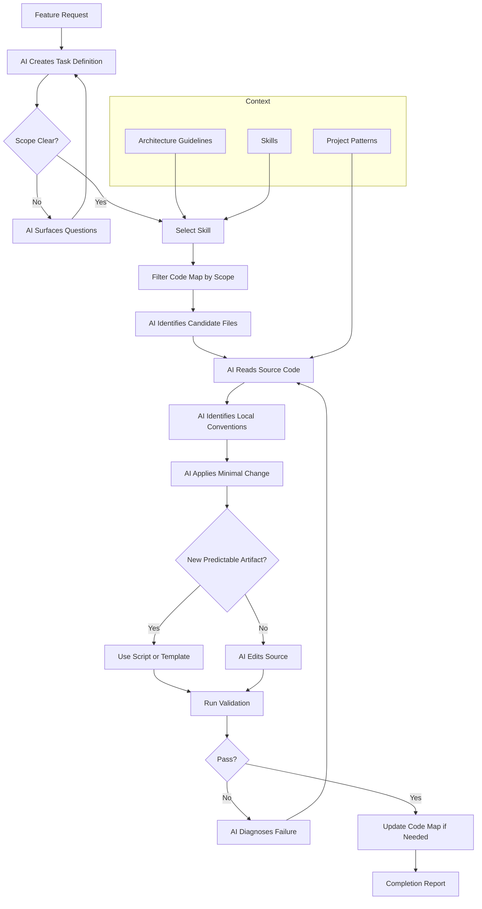

# UC-04: Integrate a Feature into Existing Code

[← Use Cases](../use-cases.md)

## Goal

Add or enhance functionality inside an existing codebase without treating the project as greenfield.

## Actor

Developer / Architect

## Inputs

- feature request
- task scope definition
- selected skill
- code map
- existing source files

## Main Flow

1. AI creates a scoped task definition from the request.
2. Tool filters the code map by module, entity, operation, route, and dependency depth.
3. AI identifies candidate files.
4. AI reads the actual source code.
5. AI identifies local implementation conventions.
6. AI applies a minimal consistent change.
7. Scripts validate build, tests, and task context.
8. Code map is regenerated if needed.

## Diagram

## Output

- integrated change
- updated code map when needed
- completion report

## Components Used

Task definition, codebase visibility, architecture and patterns, change coordination, validation mechanism.

---

[← Use Cases](../use-cases.md)
