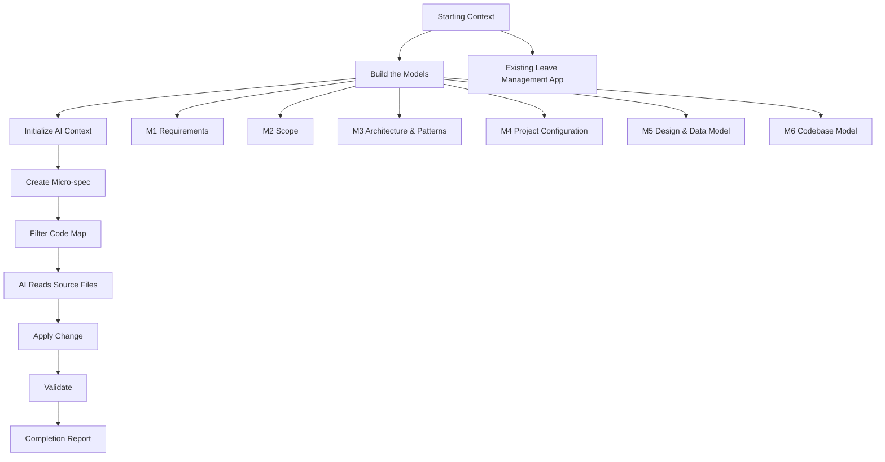

# Full Worked Example: Leave Management

[← Worked Example Home](README.md) | [Docs Home](../Home.md)

This page shows the full worked example in one place, from starting context to validation.

The collapsible sections below act like popup panels: open each step to see the details without leaving the page.

---

## End-to-End Flow



---

<details open>
<summary><strong>Step 1 — Starting Context</strong></summary>

## Existing Application

We have an existing Leave Management application.

Current features:

- Employee submits leave request
- Manager views pending requests

New request:

```text
Allow managers to approve or reject leave requests.
```

Why this is useful:

- It is not greenfield.
- It is not a trivial single-line fix.
- It requires business rules, access control, state transition, and validation.

Related page: [01. Starting Context](01-starting-context.md)

</details>

---

<details>
<summary><strong>Step 2 — Build the Models</strong></summary>

## M1. Requirements

Managers must be able to approve or reject leave requests.

Acceptance criteria:

- Manager can approve a pending leave request.
- Manager can reject a pending leave request.
- Requester cannot approve their own request.
- Cancelled requests cannot be approved.

## M2. Scope

In scope:

- approve leave request
- reject leave request
- enforce access control
- update request status

Out of scope:

- payroll integration
- email notifications
- calendar integration

## M3. Architecture & Patterns

Rules:

- write operations use command handlers
- domain entity controls state transitions
- access control policy enforces permissions
- repository persists aggregate changes

## M4. Project Configuration

Example structure:

```text
src/application/commands
src/domain
src/infrastructure/repositories
test
```

## M5. Design & Data Model

Entity: `LeaveRequest`

Fields:

- `id`
- `employeeId`
- `status`
- `startDate`
- `endDate`

Operations:

- `approve(managerId)`
- `reject(managerId, comment?)`

## M6. Codebase Model

Likely relevant files:

- `LeaveRequest.ts`
- `SubmitLeaveRequestHandler.ts`
- `LeaveRepository.ts`
- leave request tests

Related page: [02. Models](02-models.md)

</details>

---

<details>
<summary><strong>Step 3 — Initialize AI Context</strong></summary>

The goal is to give AI scoped, reusable context instead of forcing it to rediscover the codebase every time.

Run:

```bash
npm run init-ai-mde
npm run analyze
npm run filter-code-map -- --entity LeaveRequest --operation approve
```

Expected outputs:

```text
.ai/code-map.full.json
.ai/context/task.submap.json
.ai/context/task.files.txt
```

Interpretation:

- the full code-map is for tools
- the filtered submap is for AI
- the candidate file list tells AI what source files to inspect next

Related page: [03. Initialize AI Context](03-initialize-ai-context.md)

</details>

---

<details>
<summary><strong>Step 4 — Create the Micro-spec</strong></summary>

## Micro-spec: ApproveLeaveRequest

```text
Goal:
Allow a manager to approve or reject a leave request.

Inputs:
- leaveRequestId
- managerId
- decision: approve | reject
- comment? optional

Rules:
- only managers can approve or reject
- requester cannot approve own request
- cancelled requests cannot be approved
- approved request becomes Approved
- rejected request becomes Rejected

Expected changes:
- command handler
- access control policy
- domain method
- repository save
- tests
```

This micro-spec is intentionally small. It is not a full requirements document. It is a task contract.

Related page: [04. Change Request](04-change-request.md)

</details>

---

<details>
<summary><strong>Step 5 — AI Execution Plan</strong></summary>

The AI should not freely edit the repository. It should follow a skill and a scoped context.

Expected plan:

```text
1. Read the micro-spec.
2. Select the add-command or integrate-feature skill.
3. Read project patterns and architecture rules.
4. Inspect candidate source files from task.files.txt.
5. Identify similar command handlers.
6. Apply the smallest consistent change.
7. Add or update tests.
8. Run validation.
```

The AI may produce an implementation plan like:

```text
Affected artifacts:
- ApproveLeaveRequestCommand
- ApproveLeaveRequestHandler
- LeaveAccessControl.canApprove
- LeaveRequest.approve
- LeaveRepository.save
- approve leave tests
```

</details>

---

<details>
<summary><strong>Step 6 — Example Code Shape</strong></summary>

The exact code depends on the project, but the intended shape is:

```ts
export class LeaveRequest {
  constructor(
    public readonly id: string,
    public readonly employeeId: string,
    public status: "Pending" | "Approved" | "Rejected" | "Cancelled"
  ) {}

  approve(managerId: string): void {
    if (this.employeeId === managerId) {
      throw new Error("Requester cannot approve own leave request");
    }

    if (this.status !== "Pending") {
      throw new Error("Only pending leave requests can be approved");
    }

    this.status = "Approved";
  }
}
```

Command handler shape:

```ts
export class ApproveLeaveRequestHandler {
  constructor(
    private readonly leaveRepository: LeaveRepository,
    private readonly accessControl: LeaveAccessControl
  ) {}

  async execute(command: ApproveLeaveRequestCommand, context: RequestContext) {
    const leaveRequest = await this.leaveRepository.findById(command.leaveRequestId);

    if (!leaveRequest) {
      throw new Error("Leave request not found");
    }

    if (!this.accessControl.canApprove(context, leaveRequest)) {
      throw new Error("Not authorized to approve leave request");
    }

    leaveRequest.approve(context.userId);
    await this.leaveRepository.save(leaveRequest, context.transaction);

    return leaveRequest;
  }
}
```

The important point is not this exact code. The important point is the separation of concerns:

- handler orchestrates
- access control authorizes
- entity enforces state transition
- repository persists

</details>

---

<details>
<summary><strong>Step 7 — Validation</strong></summary>

Run:

```bash
npm run validate-task
npm run build
npm test
```

Validation should answer:

- Did the task context exist?
- Did the code compile?
- Did tests pass?
- Did the change stay inside expected scope?

Related page: [05. Validation](05-validation.md)

</details>

---

<details>
<summary><strong>Step 8 — Completion Report</strong></summary>

A good AI completion report should be explicit.

Example:

```text
Completion Report

Change:
Implemented approval and rejection of leave requests.

Files changed:
- src/application/commands/ApproveLeaveRequestHandler.ts
- src/domain/LeaveRequest.ts
- src/domain/LeaveAccessControl.ts
- test/leave/approve-leave-request.test.ts

Rules enforced:
- manager only
- requester cannot approve own request
- cancelled requests cannot be approved
- only pending requests can transition to Approved or Rejected

Validation:
- npm run validate-task: passed
- npm run build: passed
- npm test: passed

Models updated:
- M5 Design & Data Model updated with approve/reject operations
- M6 Codebase Model regenerated after code change
```

</details>

---

## What This Example Proves

This example shows the difference between loose AI coding and structured AI-assisted engineering.

Loose AI coding:

```text
prompt → code → hope → review
```

Structured AI-assisted engineering:

```text
context → models → micro-spec → scoped code-map → skill-guided edit → validation → report
```

The second flow is slower at the start, but it scales better across repeated changes.

---

## Navigation

[← Worked Example Home](README.md) | [Docs Home](../Home.md)
