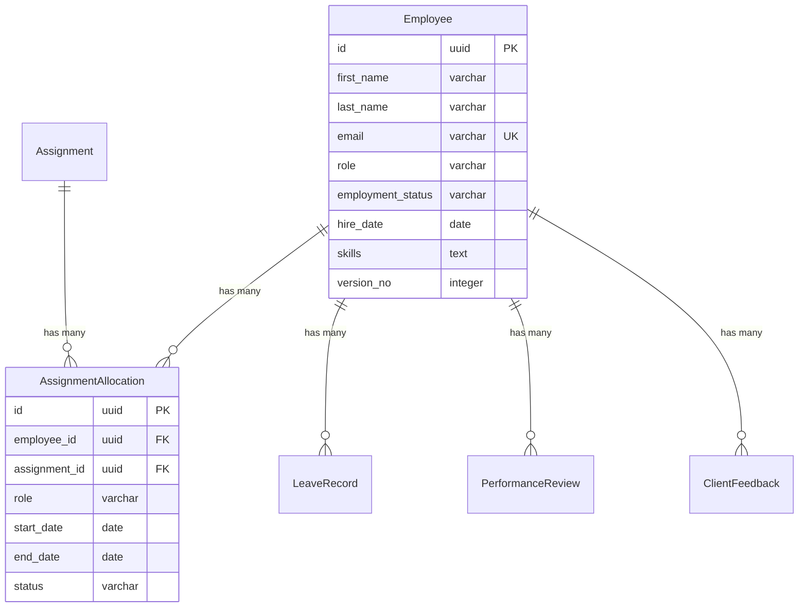

# M5. Design and Data Model — Sample

## Overview

The design and data model defines what the system should be — its domain structure, entity specifications, operations, and persistence model. This is the intent; the codebase (M6) is the implementation.

---

## Entity Specification (excerpt)

```json
{
  "entityId": "ent-employee",
  "entityName": "Employee",
  "category": "aggregate-root",
  "owningModule": "employee",
  "attributes": [
    { "name": "id", "dataType": "id", "required": true, "purpose": "control", "systemKey": true },
    { "name": "first_name", "dataType": "varchar", "required": true, "purpose": "business" },
    { "name": "last_name", "dataType": "varchar", "required": true, "purpose": "business" },
    { "name": "email", "dataType": "varchar", "required": true, "purpose": "business", "businessKey": true,
      "constraints": ["Unique across employees"] },
    { "name": "employment_status", "dataType": "varchar", "required": true, "purpose": "status",
      "exampleValues": ["Active", "Inactive"] }
  ],
  "relationships": [
    { "entity": "ent-assignment-allocation", "type": "has-many", "cardinality": "1:N" },
    { "entity": "ent-leave-record", "type": "has-many", "cardinality": "1:N" }
  ],
  "rules": [
    { "id": "RULE-EMPLOYEE-001", "name": "UniqueEmail", "condition": "Employee is created or email changes",
      "action": "Reject if another employee already uses the same email." }
  ],
  "stateMachine": {
    "states": ["Active", "Inactive"],
    "initial": "Active",
    "transitions": [
      { "from": "Active", "to": "Inactive", "event": "EmployeeDeactivated" }
    ]
  }
}
```

---

## Subject Specification (excerpt)

```json
{
  "id": "employee",
  "label": "Employee Management",
  "entityRef": "ent-employee",
  "write_operations": [
    {
      "name": "OnboardEmployee",
      "service_method": "EmployeeService.onboard",
      "inputFields": ["first_name", "last_name", "email", "role", "skills", "hire_date"],
      "outputDto": "EmployeeResponseDto",
      "business_rules": ["BR-EMP-001"]
    }
  ],
  "read_operations": [
    {
      "name": "SearchEmployees",
      "query_method": "EmployeeQueryService.search",
      "outputDto": "EmployeeListReadDto"
    }
  ]
}
```

---

## UI Specification (excerpt)

```json
{
  "moduleId": "UI-M01",
  "routePrefix": "/employee",
  "backendSubject": "employee",
  "pages": [
    {
      "id": "/employee/list",
      "name": "Employee List",
      "pattern": "list",
      "entityRef": "ent-employee",
      "fields": ["first_name", "last_name", "role",
                  { "ref": "employment_status", "widget": "badge" },
                  "hire_date"],
      "actions": [
        { "label": "Onboard Employee", "type": "navigate", "to": "/employee/new" },
        { "label": "View Profile", "type": "navigate", "to": "/employee/profile/:id" }
      ]
    }
  ]
}
```

---

## Data Model

### Entity Relationship Diagram



---

## How Design Relates to Code

| Design Artifact | Generates |
|---|---|
| Entity spec | Domain entity, repository, mapper, DTOs, validators |
| Subject spec | Service, query service, controller |
| UI spec | Pages, routes, templates |

Design is the source of truth. Code is derived. When they drift, the design should be updated first, then code regenerated or aligned.
