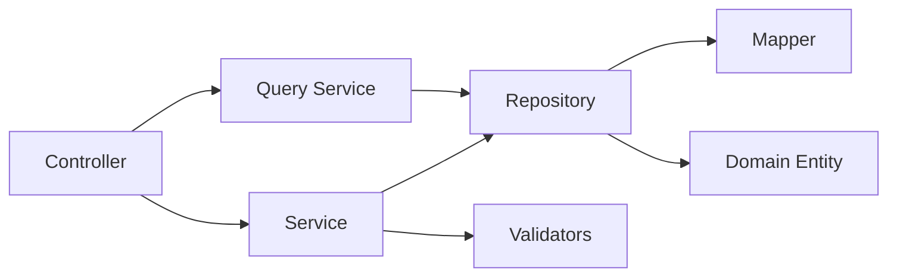
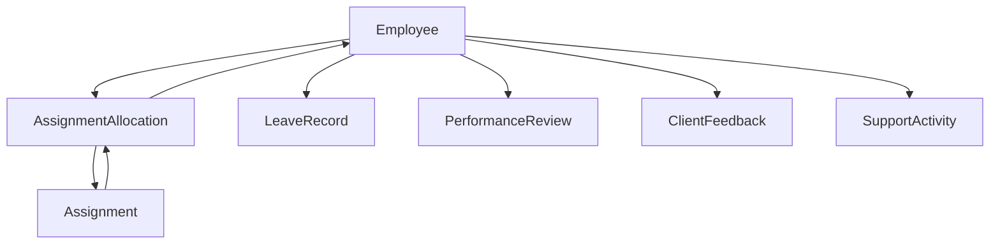

# M6. Codebase Model — Sample

## Overview

The codebase model is a structured representation of the existing code produced by static analysis. It gives AI and tooling a navigable view of what's built without reading every source file.

This is the implementation. The design (M5) is the intent. They should stay aligned.

---

## Full Code Map (excerpt)

```json
{
  "modules": [
    {
      "name": "employee",
      "path": "APP/src/server/employee",
      "entities": ["Employee"],
      "artifacts": [
        {
          "type": "controller",
          "path": "APP/src/server/employee/controller/employee.controller.ts",
          "className": "EmployeeController",
          "methods": ["onboard", "updateProfile", "offboard", "reactivate", "getById", "search", "get360View"]
        },
        {
          "type": "service",
          "path": "APP/src/server/employee/service/employee.service.ts",
          "className": "EmployeeService",
          "methods": ["onboard", "updateProfile", "offboard", "reactivate", "get360View"]
        },
        {
          "type": "query-service",
          "path": "APP/src/server/employee/query_service/employee.query-service.ts",
          "className": "EmployeeQueryService",
          "methods": ["getById", "search", "getAvailable"]
        },
        {
          "type": "repository",
          "path": "APP/src/server/employee/data_access/employee.repository.ts",
          "className": "EmployeeSqlRepository",
          "implements": "EmployeeRepository"
        },
        {
          "type": "domain-entity",
          "path": "APP/src/server/employee/domain/employee.entity.ts",
          "className": "Employee"
        }
      ],
      "dependencies": {
        "internal": [],
        "external": ["assignment-allocation", "leave-record", "performance-review", "client-feedback", "support-activity"]
      }
    }
  ]
}
```

---

## Filtered Submap (per task)

For a task scoped to "fix employee search pagination," the filtered submap narrows to:

```json
{
  "scope": "employee.search",
  "files": [
    "APP/src/server/employee/controller/employee.controller.ts",
    "APP/src/server/employee/query_service/employee.query-service.ts",
    "APP/src/server/employee/data_access/employee.repository.ts",
    "APP/src/server/employee/dto/employee-list-read.dto.ts"
  ],
  "entryPoint": "EmployeeController#search",
  "callChain": [
    "EmployeeController#search",
    "EmployeeQueryService#search",
    "EmployeeSqlRepository#findAll"
  ]
}
```

---

## Component Relationships



---

## Module Dependency Graph



---

## How It Is Used

1. **Full code map** — generated once, refreshed after structural changes. Used by tooling to understand the system.
2. **Filtered submap** — generated per task. Scopes AI attention to relevant files only.
3. **Candidate file list** — derived from the submap. AI reads these files to understand implementation detail before making changes.
